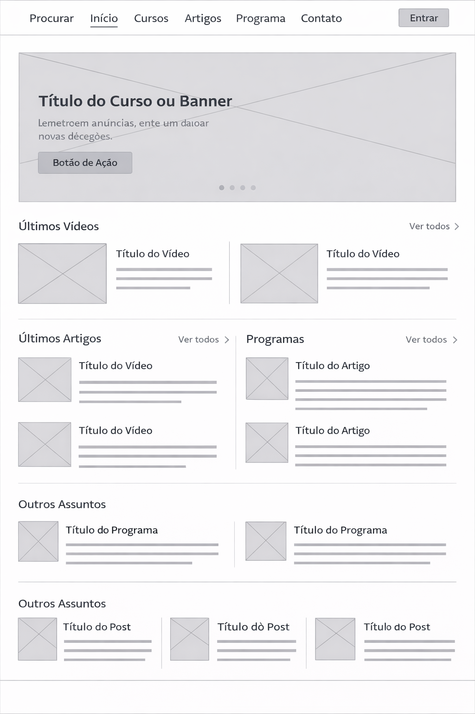
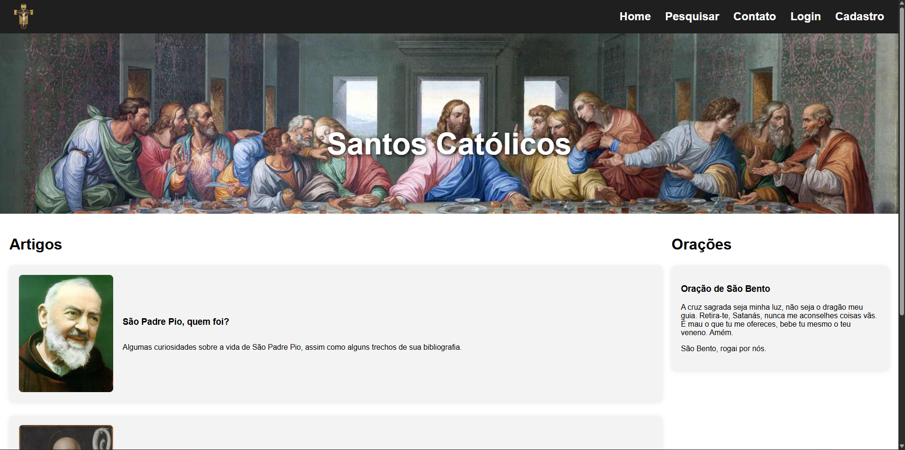
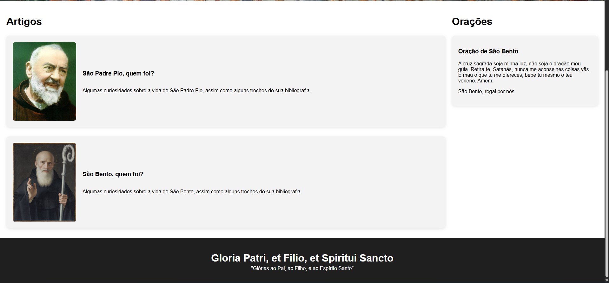

# Rafael Mota Azevedo
## Matrícula: 918434

**Foi escolhida a proposta 5: "Temas e Conteúdos Associados"**
*Eu estou fazendo um projeto inspirado em um site do Vaticano, que diz sobre a vida dos Santos da Igreja. Mas quis fazer algo de forma mais moderna, para ficar mais bonito. Mas em um contexto geral, é um site sobre Santos num geral e orações da igreja.*

